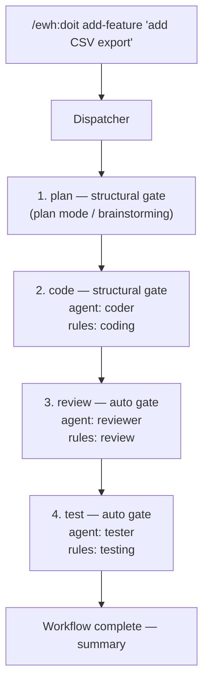

# Easy Workflow Harness (EWH)

A Claude Code plugin that turns multi-step development tasks into repeatable, structured workflows. Instead of giving Claude a vague instruction like "add a feature," EWH breaks the work into discrete steps — plan, code, review, test — each handled by a specialized agent with the right tools, rules, and context.

## Why Use This?

When you ask Claude Code to do something complex, it often tries to do everything at once: write code, review it, write tests, and update docs — all in a single pass. The results are inconsistent. Sometimes it skips testing. Sometimes it reviews its own code and declares it perfect.

EWH fixes this by:

- **Separating concerns** — different agents handle coding, reviewing, and testing, so no agent reviews its own work
- **Enforcing standards** — rules are injected into agent prompts, so coding standards and review criteria are applied consistently
- **Providing guardrails** — gates pause the workflow at key decision points so you stay in control
- **Passing context selectively** — each agent receives only the information it needs, keeping prompts focused and effective

## About This Plugin

EWH ships with predefined workflows, agents, and rules that work out of the box. These components are built into the plugin and cover common development tasks — you can use them as-is or override them for your project. Code examples in this README and in [docs/customization.md](docs/customization.md) are for demonstration purposes — adapt them to your project's needs.

## Contents

- [Getting Started](#getting-started) — install, first workflow, available commands
- [How It Works](#how-it-works) — dispatcher flow with diagram
- [Workflows](#workflows) — 9 built-in workflows
- [Agents](#agents) — 5 specialized agents
  - [How Agents Receive Context](#how-agents-receive-context)
  - [Self-Gating](#self-gating)
- [Rules](#rules) — 4 injectable rule sets
- [Gates](#gates) — control flow types
  - [Auto-Approve Start](#auto-approve-start) — per-workflow switch to skip the startup "Proceed?" gate
- [Customizing EWH for Your Project](#customizing-ewh-for-your-project) — three levels of integration (zero config / init'd / custom overrides)
- [Extending EWH](#extending-ewh) — create your own workflows, agents, rules; example project
- [Recommended: Brainstorming Skill](#recommended-brainstorming-skill) — better plan-step facilitation
- [Testing Checklist](#testing-checklist) — manual verification for contributors and project owners
- [License](#license)

## Getting Started

### Install

Test locally by pointing Claude Code at this plugin:

```bash
claude --plugin-dir /path/to/easy-workflow-harness
```

### Your First Workflow

Open any project and run:

```bash
# 1. Bootstrap your project (auto-detects language, test commands, conventions)
/ewh:doit init

# 2. Build a feature
/ewh:doit add-feature "add CSV export to the reports page"
```

The dispatcher walks you through each step, pausing at **gates** where your input is needed. You'll see a plan of what's about to happen and can approve, modify, or abort at any point.

### Available Commands

```bash
/ewh:doit list                                         # list all available workflows
/ewh:doit init                                         # bootstrap project for EWH
/ewh:doit <name> [description]                         # run a workflow
/ewh:doit <name> --auto-approval [description]         # skip the startup "Proceed?" gate (persisted)
/ewh:doit <name> --need-approval [description]         # re-enable the startup "Proceed?" gate (persisted)
```

See [Auto-Approve Start](#auto-approve-start) for what these flags do and don't bypass.

## How It Works

Here's what happens when you run `/ewh:doit add-feature "add CSV export"`:



<details>
<summary>Text version (for terminals)</summary>

```
/ewh:doit add-feature "add CSV export"
         |
         v
   +-------------+
   |  Dispatcher  |  reads workflow definition, presents plan
   +------+------+
          |
   Step 1: plan (gate: structural)
          |  You design the feature (brainstorming or plan mode)
          |  Output: .ewh-artifacts/plan.md
          v
   Step 2: code (gate: structural)
          |  Coder agent reads plan, implements changes, runs tests
          |  Rules: coding
          v
   Step 3: review (gate: auto)
          |  Reviewer agent checks code for bugs and rule compliance
          |  Rules: review
          v
   Step 4: test (gate: auto)
          |  Tester agent writes tests, runs full suite
          |  Rules: testing
          v
   Workflow complete -- summary of all steps
```

</details>

Each step receives only the context it needs — the coder reads the plan artifact, the reviewer sees what the coder changed, the tester gets a summary of both. Gates pause the workflow at decision points so you stay in control.

For details on artifact handoff between steps and partial output recovery, see [docs/customization.md](docs/customization.md#internals).

## Workflows

A workflow is a sequence of steps. Each step runs an agent (or a skill, or a direct command) with specific rules and context. EWH ships with nine built-in workflows:

| Workflow | What it does | Steps | Details |
|---|---|---|---|
| `init` | Bootstrap a project for EWH — detects language, test framework, and conventions | scan, propose, apply | [docs](docs/workflow-init.md) |
| `add-feature` | Design and implement a new feature from scratch | plan, code, review, test | [docs](docs/workflow-add-feature.md) |
| `refine-feature` | Improve existing code — scan for issues, propose fixes, implement | scan, propose, code, review, test | [docs](docs/workflow-refine-feature.md) |
| `check-fact` | Verify that documentation matches actual source code | scan-docs, validate, propose-fixes, apply-fixes | [docs](docs/workflow-check-fact.md) |
| `update-knowledge` | Update CLAUDE.md and project docs to reflect current state | read-governance, inspect-state, apply-updates | [docs](docs/workflow-update-knowledge.md) |
| `clean-up` | Full repo health check — run tests, linter, doc build, then update docs | test, check, build-docs, update-knowledge | [docs](docs/workflow-clean-up.md) |
| `create-rules` | Scaffold a project-specific rule file in .claude/rules/ | plan, propose, create, review | [docs](docs/workflow-create-rules.md) |
| `create-agents` | Scaffold a project-specific agent file in .claude/agents/ | plan, propose, create, review | [docs](docs/workflow-create-agents.md) |
| `create-workflow` | Scaffold a project-specific workflow file in .claude/workflows/ | plan, propose, create, review | [docs](docs/workflow-create-workflow.md) |

## Agents

Agents are specialized roles with distinct capabilities. Each agent has its own model, tool set, and behavioral instructions. Importantly, agents are scoped — a reviewer can read code but can't edit it, so it can't silently "fix" issues instead of reporting them.

| Agent | Model | Tools | Role |
|---|---|---|---|
| `coder` | sonnet | Read, Write, Edit, Bash, Glob, Grep | Implements changes, runs tests, follows coding rules |
| `reviewer` | sonnet | Read, Glob, Grep, Bash | Reviews code changes for bugs, quality, and rule compliance (read-only) |
| `scanner` | sonnet | Read, Glob, Grep, Bash | Scans existing code and docs for issues, stale claims, or improvements (read-only) |
| `tester` | sonnet | Read, Write, Edit, Bash, Glob, Grep | Writes tests, runs the full suite, reports bugs (does not fix source code) |
| `compliance` | haiku | Read, Glob, Grep, Bash | Lightweight auditor that verifies critical rules were followed after a step |

### How Agents Receive Context

Each agent's prompt is assembled by the dispatcher in a specific order:

1. **Agent template** — the agent's role, behavior rules, and output format
2. **Required Reading** — specific files the agent must read (from `reads:` in the workflow step)
3. **Active Rules** — the full text of rules listed in the step's `rules:` array
4. **Prior Steps** — summaries from earlier steps, filtered by the step's `context:` field
5. **Task** — the user's request plus the step description from the workflow
6. **Project Context** — applicable Harness Config values (test command, source patterns, etc.)

The project's CLAUDE.md is **not** included in this prompt — the Claude Code runtime automatically injects it into every subagent, so the dispatcher doesn't duplicate it.

### Self-Gating

Every agent has a "Before You Start" checklist. If an agent doesn't have enough context to do its job (e.g., a reviewer with no files to review), it reports what's missing and exits cleanly instead of guessing.

## Rules

Rules define standards that agents must follow. They're injected as prose into agent prompts — the agent reads them as instructions, not as code.

| Rule | What it enforces |
|---|---|
| `coding` | Minimal diffs, no dead code, no speculative abstractions, security basics, run tests after changes |
| `review` | Readability, performance, best practices, security — with severity ratings (critical/warning/nit) |
| `testing` | Test contracts not implementations, cover edge cases, run the full suite |
| `knowledge` | Source code is the authority, keep docs concise, no stale references |

Rules have a `severity` field. Rules marked `severity: critical` with a `verify` command trigger an automatic **compliance check** after the step completes — a lightweight haiku-based auditor runs the verification and reports pass/fail.

## Gates

Gates control where the workflow pauses for your input:

- **structural** — the workflow stops and shows you what's about to happen. You must confirm before it proceeds. Used for decisions that matter (approving a plan, reviewing proposed changes).
- **auto** — the workflow proceeds silently. Used for mechanical steps where human review isn't needed (running tests, automated scanning).
- **compliance** — triggered automatically when a step has critical rules with `verify` commands. If verification fails, the workflow always stops, regardless of the step's gate type. You can choose to fix, override, or abort.

You're never locked in — at any gate, you can abort the workflow. Completed work is preserved as-is.

### Auto-Approve Start

Before any workflow runs, the dispatcher prints the plan (steps, gates, expected artifacts) and asks "Proceed?". If a particular workflow feels safe enough that you don't need this prompt, you can suppress it with a **per-workflow** persisted switch:

```bash
/ewh:doit add-feature --auto-approval "your task"   # persist: skip "Proceed?" for add-feature
/ewh:doit add-feature --need-approval "your task"   # persist: re-enable "Proceed?" for add-feature
```

**The switch is per-workflow, not project-wide.** Auto-approving `add-feature` does NOT auto-approve `clean-up`, `refine-feature`, or anything else — each workflow has its own switch, so your sense of safety for one workflow doesn't leak to others.

**Where it's stored.** The flag writes to `.claude/ewh-state.json` in your project, under `auto_approve_start.<workflow_name>`:

```json
{
  "auto_approve_start": {
    "add-feature": true,
    "clean-up": false
  }
}
```

Each workflow's markdown file also declares an `auto_approve_start: false` default in its frontmatter — `.claude/ewh-state.json` overrides it on a per-project basis. Default behavior when neither is set: ask. The plan is still printed when auto-approved — you just don't have to confirm it.

**Recommended:** add `.claude/ewh-state.json` to your project's `.gitignore`. The auto-approve switches express developer-local trust judgments, so they shouldn't be committed. New projects: `/ewh:doit init` adds this line for you automatically (alongside `.ewh-artifacts/`). Existing projects that ran `init` before this line was added: re-run `/ewh:doit init` — the gitignore step is idempotent and will append only the missing line without disturbing anything else.

**Permission prompt on first write.** The first time the dispatcher writes to `.claude/ewh-state.json`, Claude Code may show a normal file-write permission prompt. That's expected — accept it to allow future toggles.

**This switch only bypasses the startup "Proceed?" gate.** Every other gate is unaffected:

- **Stale artifact cleanup gate** — if `.ewh-artifacts/` from a prior run exists, the dispatcher always asks "Clear them?" before wiping the workspace. This gate exists to protect in-progress work and is *not* covered by `--auto-approval` — clearing files is a destructive action that always requires explicit confirmation.
- All per-step **structural** gates
- All **compliance** failure gates
- All **error** / **artifact verification** gates

If you want truly hands-off execution, you also need to manually clear `.ewh-artifacts/` before starting (or accept the one extra prompt at the top).

## Customizing EWH for Your Project

EWH works at three levels of customization:

### Level 1: Zero Config

Just run `/ewh:doit <workflow>` in any project. The dispatcher asks for missing values (test command, source patterns) as it needs them.

### Level 2: Init'd

Run `/ewh:doit init` once. It scans your project and adds a `## Harness Config` section to your CLAUDE.md:

```markdown
## Harness Config

- Language: Python
- Test command: pytest
- Check command: ruff check .
- Source pattern: src/**/*.py
- Test pattern: tests/test_*.py
- Doc build: mkdocs build
- Conventions: PEP 8, type hints, Google-style docstrings
```

This is what agents receive under `## Project Context` — they use it to run tests, find source files, and follow your conventions.

### Level 3: Custom Overrides

Add project-specific overrides in your `.claude/` directory:

| What | Where | How it merges |
|---|---|---|
| Agents | `.claude/agents/<name>.md` | Replaces the plugin agent, or extends it |
| Rules | `.claude/rules/<name>.md` (subfolders allowed, e.g. `.claude/rules/ewh/<name>.md`) | Concatenated with the plugin rule (both apply); discovered recursively |
| Workflows | `.claude/workflows/<name>.md` | Replaces the plugin workflow entirely |

#### Extend an Agent

If you want to keep the built-in agent behavior but add project-specific instructions:

```markdown
<!-- .claude/agents/coder.md -->
---
extends: ewh:coder
---

## Project-Specific

- Use our internal logging library, not print statements
- All new endpoints need OpenAPI annotations
- Run `make lint` after changes
```

#### Supplement a Rule

Project rules are appended to the plugin rule, so both apply:

```markdown
<!-- .claude/rules/coding.md -->
## Project-Specific

- Use `logger.error()` not `raise Exception()`
- All SQL queries must use parameterized statements
- New files go in `src/app/` not project root
```

#### Replace a Workflow

Create `.claude/workflows/add-feature.md` with your own step definitions. It completely replaces the plugin's version. See [docs/customization.md](docs/customization.md#creating-your-own-workflow) for the format.

## Extending EWH

Create your own workflows, agents, and rules — see [docs/customization.md](docs/customization.md) for full documentation with examples, field references, and detail on internals like artifact handoff and partial output recovery.

For a working example, see the [greedy snake project](examples/project_greedy_snake/) which demonstrates all three customization types:
- **Custom agent**: [`ergo`](examples/project_greedy_snake/.claude/agents/ergo.md) — a deadpan one-liner commentator that reacts to workflow results
- **Custom rule**: [`ergo-voice`](examples/project_greedy_snake/.claude/rules/ergo-voice.md) — personality consistency rules for the ergo agent's dry-wit tone
- **Custom workflow**: [`add-game-feature`](examples/project_greedy_snake/.claude/workflows/add-game-feature.md) — extends add-feature with a manual browser verification step

## Recommended: [Brainstorming](https://github.com/obra/superpowers/tree/main/skills/brainstorming) Skill

The `add-feature` workflow's plan step works best with a dedicated brainstorming skill that provides structured design facilitation — understanding lock, decision log, alternatives exploration. Without it, the step falls back to Claude's built-in plan mode, which still works but provides less structure.


## Testing Checklist

Before merging changes to the dispatcher or override resolution logic, run the manual checks in [docs/testing-overrides.md](docs/testing-overrides.md). The checklist covers the three resolution paths — agent override, rule concatenation, and workflow override — with concrete fixture files and pass/fail signals for each.

Project owners can also use it to confirm that their `.claude/` overrides are picked up correctly.

## License

MIT
