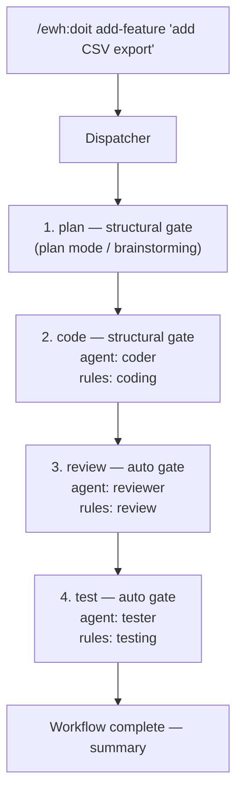

# Easy Workflow Harness (EWH)

A Claude Code plugin that turns multi-step development tasks into repeatable, structured workflows. Instead of giving Claude a vague instruction like "add a feature," EWH breaks the work into discrete steps — plan, code, review, test — each handled by a specialized agent with the right tools, rules, and context.

## Why Use This?

When you ask Claude Code to do something complex, it often tries to do everything in one pass: code, review, test, and update docs simultaneously. Results are inconsistent — sometimes it skips tests, sometimes it reviews its own code and declares it perfect, sometimes it loses track of what the plan even was.

EWH fixes this by breaking the work into discrete, role-scoped steps. Here's what you get:

- **Lightweight** — the entire plugin is Markdown. No runtime, no build step, no dependencies to install. The dispatcher itself is a single `SKILL.md` file, a few hundred lines you can read in one sitting.
- **Beginner-friendly** — `/ewh:doit init` auto-detects your language, test command, and conventions, writes them into your CLAUDE.md, and shows an onboarding guide with all available commands. Zero-config mode works in any project without setup. Commands are discoverable via `/ewh:doit list`.
- **A good starting point for your own harness** — three customization levels (zero-config, init'd, custom overrides), the `create` subcommand (`/ewh:doit create rule|agent|workflow`) that walks you through authoring your own pieces interactively, and a complete worked example under `examples/project_greedy_snake/`. Fork the project rules, replace the workflows, swap the agents — nothing is locked in.
- **Separation of concerns** — different agents handle coding, reviewing, and testing. A reviewer literally *cannot* edit code (read-only tool scope), so it can't silently "fix" issues instead of reporting them.
- **Enforced standards** — rules are injected as prose into agent prompts. Coding conventions, review criteria, and testing requirements apply consistently without you re-pasting them every run.
- **Guardrails that keep you in control** — structural gates pause at decisions that matter; compliance gates trigger automatically when critical rules are at stake. You can abort any workflow at any gate; completed work is preserved.
- **Disciplined context management** — each agent receives only what it needs: required reading, active rules, filtered summaries of prior steps. No bloated prompts, no irrelevant history. Self-gating lets agents bail cleanly when context is insufficient instead of guessing.
- **Chunked dispatch** — steps that scan many files can declare `chunked: true`. The dispatcher prompts for file scope on first run, caches the patterns in `.claude/ewh-state.json`, then enumerates → splits → fans out parallel workers → merges results. No more agents burning their entire turn budget on file discovery before writing anything useful.

> **A note on scope.** EWH is a simple, experimental tool — not a production orchestration framework. It is deliberately built from plain Markdown files and a small dispatcher skill, so every behavior lives in a file you can open, read, and change. The goal isn't for everyone to use EWH as-is; it's to show that a useful multi-agent harness can be built out of nothing but Markdown and conventions, and to give you a decent starting point for building your own.

## About This Plugin

EWH ships with predefined workflows, agents, and rules that work out of the box. These components are built into the plugin and cover common development tasks — you can use them as-is or override them for your project. Code examples in this README and in [docs/customization.md](docs/customization.md) are for demonstration purposes — adapt them to your project's needs.

## Contents

- [Getting Started](#getting-started) — install, first workflow, available commands
- [How It Works](#how-it-works) — dispatcher flow with diagram
- [Workflows](#workflows) — 4 built-in workflows (multi-step, agent-driven)
- [Subcommands](#subcommands) — 4 built-in subcommands (lightweight, interactive)
- [Agents](#agents) — 5 specialized agents
  - [How Agents Receive Context](#how-agents-receive-context)
  - [Self-Gating](#self-gating)
  - [Extending Agent Tool Pools](#extending-agent-tool-pools)
- [Rules](#rules) — 4 injectable rule sets
- [Gates](#gates) — control flow types
  - [Auto-Approve Start](#auto-approve-start) — per-workflow switch to skip the startup "Proceed?" gate
  - [Script Proposal](#script-proposal) — dispatcher proposes scripts for mechanical steps to save tokens
- [Customizing EWH for Your Project](#customizing-ewh-for-your-project) — three levels of integration (zero config / init'd / custom overrides)
- [Extending EWH](#extending-ewh) — create your own workflows, agents, rules; example project
- [Recommended: Brainstorming Skill](#recommended-brainstorming-skill) — better plan-step facilitation
- [Testing Checklist](#testing-checklist) — manual verification for contributors and project owners
- [License](#license)

## Getting Started

### Install

> **Note.** EWH is in the process of being submitted to Anthropic's official plugin marketplace. Until that listing is live, use one of the two install methods below.

**Option A — Via the marketplace (recommended for users)**

EWH is a self-hosted marketplace as well as a plugin, so you can add it directly from GitHub:

```bash
/plugin marketplace add willju-wangqian/easy-workflow-harness
/plugin install ewh@willju-plugins
```

Verify the install by running `/ewh:doit list` inside any project.

**Option B — Via `--plugin-dir` (for local development)**

Clone the repo and point Claude Code at the local checkout:

```bash
claude --plugin-dir /path/to/easy-workflow-harness
```

Use this path if you're modifying the plugin and want edits to take effect immediately without pushing a commit.

### Your First Workflow

Open any project and run:

```bash
# 1. Bootstrap your project (auto-detects language, test commands, conventions)
/ewh:doit init

# 2. Build a feature
/ewh:doit add-feature "add CSV export to the reports page"
```

The dispatcher walks you through each step, pausing at **gates** where your input is needed. You'll see a plan of what's about to happen and can approve, modify, or abort at any point.

### Available Commands

```bash
# Subcommands (lightweight, interactive)
/ewh:doit init                                         # bootstrap project + onboarding guide
/ewh:doit cleanup                                     # run configured cleanup tasks
/ewh:doit cleanup --manage-tasks                      # configure cleanup tasks
/ewh:doit create [rule|agent|workflow]                  # scaffold a project artifact
/ewh:doit expand-tools [description]                   # discover and persist agent tool expansions

# Workflows (multi-step, agent-driven)
/ewh:doit list                                         # list all workflows and subcommands
/ewh:doit <name> [description]                         # run a workflow
/ewh:doit <name> --auto-approval [description]         # skip the startup "Proceed?" gate (persisted)
/ewh:doit <name> --need-approval [description]         # re-enable the startup "Proceed?" gate (persisted)
/ewh:doit <name> --manage-scripts [description]        # manage cached scripts before running

# Override control
/ewh:doit <subcommand> --no-override                   # force built-in subcommand when a same-name project workflow exists
```

See [Subcommands](#subcommands), [Auto-Approve Start](#auto-approve-start), [Script Proposal](#script-proposal), and [Extending Agent Tool Pools](#extending-agent-tool-pools) for details.

## How It Works

Here's what happens when you run `/ewh:doit add-feature "add CSV export"`:



<details>
<summary>Text version (for terminals)</summary>

```
/ewh:doit add-feature "add CSV export"
         |
         v
   +-------------+
   |  Dispatcher  |  reads workflow definition, presents plan
   +------+------+
          |
   Step 1: plan (gate: structural)
          |  You design the feature (brainstorming or plan mode)
          |  Output: .ewh-artifacts/plan.md
          v
   Step 2: code (gate: structural)
          |  Coder agent reads plan, implements changes, runs tests
          |  Rules: coding
          v
   Step 3: review (gate: auto)
          |  Reviewer agent checks code for bugs and rule compliance
          |  Rules: review
          v
   Step 4: test (gate: auto)
          |  Tester agent writes tests, runs full suite
          |  Rules: testing
          v
   Workflow complete -- summary of all steps
```

</details>

Each step receives only the context it needs — the coder reads the plan artifact, the reviewer sees what the coder changed, the tester gets a summary of both. Gates pause the workflow at decision points so you stay in control.

For details on artifact handoff between steps and partial output recovery, see [docs/customization.md](docs/customization.md#internals).

## Workflows

A workflow is a sequence of steps. Each step runs an agent (or a skill, or a direct command) with specific rules and context. EWH ships with four built-in workflows:

| Workflow | What it does | Steps | Details |
|---|---|---|---|
| `add-feature` | Design and implement a new feature from scratch | plan, code, review, test | [docs](docs/workflow-add-feature.md) |
| `refine-feature` | Improve existing code — scan for issues, propose fixes, implement | scan, propose, code, review, test | [docs](docs/workflow-refine-feature.md) |
| `check-fact` | Verify that documentation matches actual source code | scan-docs, validate, propose-fixes, apply-fixes | [docs](docs/workflow-check-fact.md) |
| `update-knowledge` | Update CLAUDE.md and project docs to reflect current state | read-governance, inspect-state, apply-updates | [docs](docs/workflow-update-knowledge.md) |

Workflows use the full dispatcher machinery: agents, rules, compliance checks, artifact handoff, context passing, script proposal, and chunked dispatch.

## Subcommands

Subcommands are lightweight, interactive operations handled directly by the dispatcher — no agents, rules, or compliance checks. They're faster and use fewer tokens than workflows.

| Subcommand | What it does | Details |
|---|---|---|
| `init` | Bootstrap a project — detect language/framework, write Harness Config, show onboarding guide | [docs](docs/subcommand-init.md) |
| `cleanup` | Run user-configured cleanup tasks (tests, linting, formatting) | [docs](docs/subcommand-cleanup.md) |
| `create [type]` | Scaffold a project-specific rule, agent, or workflow interactively | [docs](docs/subcommand-create.md) |
| `expand-tools` | Discover MCP/plugin tools and persist per-agent expansions | [docs](docs/expand-agent-tools.md) |

**Override control:** If you create a project workflow with the same name as a subcommand (e.g., `.claude/workflows/init.md`), the project workflow takes precedence. Use `--no-override` to force the built-in subcommand:

```bash
/ewh:doit init --no-override    # run built-in init even if .claude/workflows/init.md exists
```

## Agents

Agents are specialized roles with distinct capabilities. Each agent has its own model, tool set, and behavioral instructions. Importantly, agents are scoped — a reviewer's role is to report findings, not to "fix" issues. (Scanner and reviewer now carry `Edit` to support the chunked artifact append pattern, but their instructions forbid editing anything other than their chunk artifact — see `incremental: true` below.)

| Agent | Model | Tools | Role |
|---|---|---|---|
| `coder` | sonnet | Read, Write, Edit, Bash, Glob, Grep | Implements changes, runs tests, follows coding rules |
| `reviewer` | sonnet | Read, Edit, Glob, Grep, Bash | Reviews code changes for bugs, quality, and rule compliance (Edit is scoped to the chunked artifact append pattern — reviewer does not modify source) |
| `scanner` | sonnet | Read, Edit, Glob, Grep, Bash | Scans existing code and docs for issues, stale claims, or improvements (Edit is scoped to the chunked artifact append pattern — scanner does not modify source) |
| `tester` | sonnet | Read, Write, Edit, Bash, Glob, Grep | Writes tests, runs the full suite, reports bugs (does not fix source code) |
| `compliance` | haiku | Read, Glob, Grep, Bash | Lightweight auditor that verifies critical rules were followed after a step |

### How Agents Receive Context

Each agent's prompt is assembled by the dispatcher in a specific order:

1. **Agent template** — the agent's role, behavior rules, and output format
2. **Required Reading** — specific files the agent must read (from `reads:` in the workflow step)
3. **Active Rules** — the full text of rules listed in the step's `rules:` array
4. **Prior Steps** — summaries from earlier steps, filtered by the step's `context:` field
5. **Task** — the user's request plus the step description from the workflow
6. **Project Context** — applicable Harness Config values (test command, source patterns, etc.)

The project's CLAUDE.md is **not** included in this prompt — the Claude Code runtime automatically injects it into every subagent, so the dispatcher doesn't duplicate it.

### Self-Gating

Every agent has a "Before You Start" checklist. If an agent doesn't have enough context to do its job (e.g., a reviewer with no files to review), it reports what's missing and exits cleanly instead of guessing.

### Extending Agent Tool Pools

Each agent's `tools` list in its frontmatter is not fixed. You can extend it with tools from any MCP server you have connected — [Serena](https://github.com/oraios/serena), GitHub MCP, browser automation, your own custom MCP — to give agents new capabilities without changing their role.

The one rule that must hold: **read-only agents may only gain read-only tools**. The `scanner`, `reviewer`, and `compliance` agents are read-only with respect to source code — they must not gain mutation tools that reach source (e.g. `mcp__serena__replace_symbol_body` to the reviewer would silently turn a reviewer into a coder and break the separation-of-concerns guarantee). Scanner and reviewer do carry `Edit` in their default tool list, but only to support the chunked-dispatch incremental-append pattern (see §1c of the dispatcher and `incremental: true` in agent frontmatter); their behavioral instructions forbid editing anything other than the chunk artifact. The `coder` and `tester` agents may safely receive both read-only and read-write tools.

**Recommended: use the `expand-tools` subcommand.** It discovers available tools, matches them to your intent, proposes per-agent assignments respecting read-only tiers, and persists the config in `.claude/ewh-state.json`. Overrides are generated as `.claude/agents/<name>.md` files that survive plugin reinstalls.

```bash
/ewh:doit expand-tools "add Serena tools for semantic code navigation"
```

After a plugin reinstall, rerun `expand-tools` and choose "Regenerate overrides" to restore your tool expansions from the persisted config. See [specs/expand-tools.md](specs/expand-tools.md) for the full design spec.

For manual expansion (advanced), see [docs/expand-agent-tools.md](docs/expand-agent-tools.md) for a copy-paste prompt that walks Claude through the expansion with placeholders and a worked example using [Serena](https://github.com/oraios/serena) MCP.

> **Heads-up: plugin reinstalls overwrite in-place tool patches.** If you expanded tools manually (not via `expand-tools`), reinstalling or auto-updating the plugin replaces the `agents/` directory and reverts your patched tool lists to defaults. The `expand-tools` subcommand avoids this problem by persisting config in `ewh-state.json` and generating project-level overrides in `.claude/agents/`. If you expanded manually, keep a note of your additions so you can reapply them, or move the customization into a project override (`.claude/agents/<name>.md` with both `name: <name>` and `extends: ewh:<name>` — `name:` is required so the override registers as a subagent type), which survives reinstalls.

## Rules

Rules define standards that agents must follow. They're injected as prose into agent prompts — the agent reads them as instructions, not as code.

| Rule | What it enforces |
|---|---|
| `coding` | Minimal diffs, no dead code, no speculative abstractions, security basics, run tests after changes |
| `review` | Readability, performance, best practices, security — with severity ratings (critical/warning/nit) |
| `testing` | Test contracts not implementations, cover edge cases, run the full suite |
| `knowledge` | Source code is the authority, keep docs concise, no stale references |

Rules have a `severity` field. Rules marked `severity: critical` with a `verify` command trigger an automatic **compliance check** after the step completes — a lightweight haiku-based auditor runs the verification and reports pass/fail.

## Gates

Gates control where the workflow pauses for your input:

- **structural** — the workflow stops and shows you what's about to happen. You must confirm before it proceeds. Used for decisions that matter (approving a plan, reviewing proposed changes).
- **auto** — the workflow proceeds silently. Used for mechanical steps where human review isn't needed (running tests, automated scanning).
- **compliance** — triggered automatically when a step has critical rules with `verify` commands. If verification fails, the workflow always stops, regardless of the step's gate type. You can choose to fix, override, or abort.

You're never locked in — at any gate, you can abort the workflow. Completed work is preserved as-is.

### Auto-Approve Start

Before any workflow runs, the dispatcher prints the plan (steps, gates, expected artifacts) and asks "Proceed?". If a particular workflow feels safe enough that you don't need this prompt, you can suppress it with a **per-workflow** persisted switch:

```bash
/ewh:doit add-feature --auto-approval "your task"   # persist: skip "Proceed?" for add-feature
/ewh:doit add-feature --need-approval "your task"   # persist: re-enable "Proceed?" for add-feature
```

**The switch is per-workflow, not project-wide.** Auto-approving `add-feature` does NOT auto-approve `refine-feature`, `check-fact`, or anything else — each workflow has its own switch, so your sense of safety for one workflow doesn't leak to others.

**Where it's stored.** The flag writes to `.claude/ewh-state.json` in your project, under `auto_approve_start.<workflow_name>`:

```json
{
  "auto_approve_start": {
    "add-feature": true,
    "refine-feature": false
  }
}
```

Each workflow's markdown file also declares an `auto_approve_start: false` default in its frontmatter — `.claude/ewh-state.json` overrides it on a per-project basis. Default behavior when neither is set: ask. The plan is still printed when auto-approved — you just don't have to confirm it.

**Recommended:** add `.claude/ewh-state.json` to your project's `.gitignore`. Auto-approve switches, chunked-dispatch scopes, agent tool expansions, and cleanup tasks are stored together in this file and express developer-local preferences, so they shouldn't be committed (unless you want shared team-wide settings). New projects: `/ewh:doit init` adds these lines for you automatically (alongside `.ewh-artifacts/`). Existing projects that ran `init` before these lines were added: re-run `/ewh:doit init` — the gitignore step is idempotent and will append only the missing lines without disturbing anything else.

**Permission prompt on first write.** The first time the dispatcher writes to `.claude/ewh-state.json`, Claude Code may show a normal file-write permission prompt. That's expected — accept it to allow future toggles.

**This switch only bypasses the startup "Proceed?" gate.** Every other gate is unaffected:

- **Stale artifact cleanup gate** — if `.ewh-artifacts/` from a prior run exists, the dispatcher always asks "Clear them?" before wiping the workspace. This gate exists to protect in-progress work and is *not* covered by `--auto-approval` — clearing files is a destructive action that always requires explicit confirmation.
- All per-step **structural** gates
- All **compliance** failure gates
- All **error** / **artifact verification** gates

If you want truly hands-off execution, you also need to manually clear `.ewh-artifacts/` before starting (or accept the one extra prompt at the top).

### Script Proposal

Some workflow steps don't need an LLM — they just call CLI tools (linting, formatting, running a test suite). The dispatcher can detect these mechanical steps and propose running a Bash script instead of spawning an agent, saving tokens.

**How it works:**

1. A step can declare an explicit `script:` path in its workflow definition, or the dispatcher can detect scriptability at runtime
2. If no script exists and the step looks mechanical, the dispatcher proposes generating one — you can approve, reject, edit, or ask for regeneration
3. Approved scripts are cached in `.claude/ewh-scripts/<workflow>/<step>.sh` and reused on subsequent runs
4. Cached scripts show their path and a one-line summary when running — no confirmation gate needed (you already approved the content)
5. If a step's description changes after a script was cached, the dispatcher flags it as potentially stale and asks you to review

**Failure handling** is controlled per-step via `script_fallback:`:

- `gate` (default) — stop and offer: retry / edit script / fall back to agent / skip / abort
- `auto` — silently fall back to the step's agent (requires an `agent:` to be defined on the step)

**Consecutive scriptable steps** with no structural gates between them can be merged into a single combined script when the dispatcher proposes it.

**Managing cached scripts:**

```bash
/ewh:doit add-feature --manage-scripts    # view/edit/delete/regenerate cached scripts before running
```

This opens a pre-run management menu for all cached scripts in the workflow. Use it to review stale scripts, edit cached ones, or delete scripts to force re-evaluation.

**Where scripts live.** Cached scripts are stored in `.claude/ewh-scripts/<workflow>/<step>.sh`. Gitignore them for developer-local preferences, or commit them to share team-wide scripts. See [specs/script-proposal.md](specs/script-proposal.md) for the full design spec.

## Customizing EWH for Your Project

EWH works at three levels of customization:

### Level 1: Zero Config

Just run `/ewh:doit <workflow>` in any project. The dispatcher asks for missing values (test command, source patterns) as it needs them.

### Level 2: Init'd

Run `/ewh:doit init` once. It scans your project and adds a `## Harness Config` section to your CLAUDE.md:

```markdown
## Harness Config

- Language: Python
- Test command: pytest
- Check command: ruff check .
- Source pattern: src/**/*.py
- Test pattern: tests/test_*.py
- Doc build: mkdocs build
- Conventions: PEP 8, type hints, Google-style docstrings
```

This is what agents receive under `## Project Context` — they use it to run tests, find source files, and follow your conventions.

### Level 3: Custom Overrides

Add project-specific overrides in your `.claude/` directory:

| What | Where | How it merges |
|---|---|---|
| Agents | `.claude/agents/<name>.md` | Replaces the plugin agent, or extends it |
| Rules | `.claude/rules/<name>.md` (subfolders allowed, e.g. `.claude/rules/ewh/<name>.md`) | Concatenated with the plugin rule (both apply); discovered recursively |
| Workflows | `.claude/workflows/<name>.md` | Replaces the plugin workflow entirely |

#### Extend an Agent

If you want to keep the built-in agent behavior but add project-specific instructions:

```markdown
<!-- .claude/agents/coder.md -->
---
extends: ewh:coder
---

## Project-Specific

- Use our internal logging library, not print statements
- All new endpoints need OpenAPI annotations
- Run `make lint` after changes
```

#### Supplement a Rule

Project rules are appended to the plugin rule, so both apply:

```markdown
<!-- .claude/rules/coding.md -->
## Project-Specific

- Use `logger.error()` not `raise Exception()`
- All SQL queries must use parameterized statements
- New files go in `src/app/` not project root
```

#### Replace a Workflow

Create `.claude/workflows/add-feature.md` with your own step definitions. It completely replaces the plugin's version. See [docs/customization.md](docs/customization.md#creating-your-own-workflow) for the format.

## Extending EWH

Create your own workflows, agents, and rules — see [docs/customization.md](docs/customization.md) for full documentation with examples, field references, and detail on internals like artifact handoff and partial output recovery.

For a working example, see the [greedy snake project](examples/project_greedy_snake/) which demonstrates all three customization types:
- **Custom agent**: [`ergo`](examples/project_greedy_snake/.claude/agents/ergo.md) — a deadpan one-liner commentator that reacts to workflow results
- **Custom rule**: [`ergo-voice`](examples/project_greedy_snake/.claude/rules/ergo-voice.md) — personality consistency rules for the ergo agent's dry-wit tone
- **Custom workflow**: [`add-game-feature`](examples/project_greedy_snake/.claude/workflows/add-game-feature.md) — extends add-feature with a manual browser verification step

## Recommended: [Brainstorming](https://github.com/obra/superpowers/tree/main/skills/brainstorming) Skill

The `add-feature` workflow's plan step works best with a dedicated brainstorming skill that provides structured design facilitation — understanding lock, decision log, alternatives exploration. Without it, the step falls back to Claude's built-in plan mode, which still works but provides less structure.


## Testing Checklist

Before merging changes to the dispatcher or override resolution logic, run the manual checks in [docs/testing-overrides.md](docs/testing-overrides.md). The checklist covers the three resolution paths — agent override, rule concatenation, and workflow override — with concrete fixture files and pass/fail signals for each.

Project owners can also use it to confirm that their `.claude/` overrides are picked up correctly.

## License

MIT
